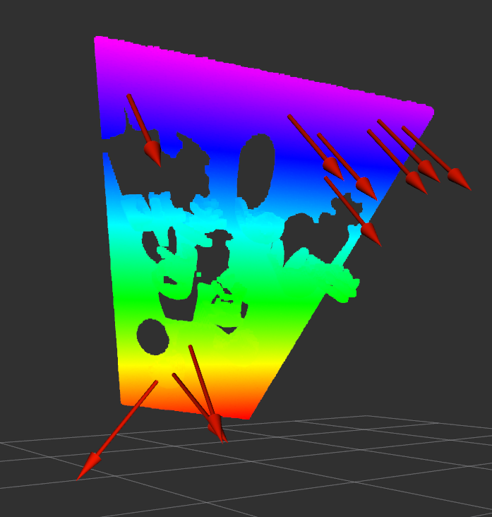

# ContinuousSuctionCupModel

Simulate and estimate suction grasps.

## Contents
- [ContinuousSuctionCupModel](#continuoussuctioncupmodel)
  * [Requirements](#requirements)
  * [Installation](#installation)
  * [Dataset](#dataset)
    * [Folder Structure](#folder-structure)
    * [Continious Suction Cup Model](#continious-suction-cup-model)
    * [3D Scene generation](#3d-scene-generation)
    * [Generating and loading a dataset](#generating-and-loading-a-dataset)
  * [Suction Grasp Net](#suction-grasp-net)
  * [Examples](#examples)
  * [Other](#other)

## Requirements
   - python3 >= 3.6
   - tensorflow >= 2.3.0

## Installation
1. Install Triemsh Visualize Wrapper
   - Clone the repository from: https://github.com/JureHudoklin/trimesh_visualize
   - Follow the Installation procedure in the repository
3. Install PointNet++ 
   - Go to pointnet2-tensorlow2 subfolder: ``` cd pointnet2-tensorflow2 ```
   - Install the poitnet by running:
   ```bash
   chmod u+x tf_ops/compile_ops.sh
   tf_ops/compile_ops.sh CUDA_VERSION
   ```
5. Install other requirements
   - run: ```pip install -r requirements.txt```


## Dataset
### Folder Structure
- To use the dataset it should have the following folder structure:
    - data/
        - meshes/
            - \<splits>/
        - grasps/
            - \<splits>/
        - scenes_3d/
            - \<splits>/

### Continious Suction Cup Model
- To test the Continious Suction Cup models a set of functions is available in "suction_cup_main.py":
- 
    ``` python
    test_contact_point(file_loc, 
                       test_point=np.array([0, 0, 0]), 
                       display_contact=True):
    ```
    Performs a full analysis of a contact point (seal evaluation, force evaluation, seal score, force score)

-   ``` python
    evaluate_object_set(root_dir,
                        config_path = None,
                        number_of_points=3000,
                        splits="test",
                        save=True,
                        overwrite=False,
                        display=False,
                        n_processors=8):
    ```
    Evaluates a set of objects. 

-   ``` python
    evaluate_object_one(obj_name,
                        root_dir,
                        config_path = None,
                        number_of_points = 3000,
                        display=True,
                        splits="test",
                        save=False):
    ```
    Evaluates a single object.

### 3D Scene generation

- Helper functions for accessing the dataset are locatied in util/dataset_utils.py
    - A grasp can be loaded using:
        ``` python
        load_grasp(obj_name, grasp_dir, filetype=".pkl")
        ```
    - A mesh can be loaded using:
        ``` python
        load_mesh(mesh_name, mesh_dir, scale=0.001):
        ```
    - A 3D scene can be loaded using:
        ``` python
        load_scene_data(scene_name, scene_dir):
        ```
### Generating and loading a dataset
- To generate grasps on an object or a set of objects, use the file: <a>suction_cup_main.py</a>
- To generate 3D scenes from evaluated objects use the file: <a>scene_render_main.py</a>
- To generate pointcloud scenes you can use <a>data_generator.py</a>


## Suction Grasp Net
### Training

### Inference with ROS
#### 1) Create the ROS package
```bash
catkin_make --only-pkg-with-deps suction_grasp_estimation
```
#### 2) Running the ROS node
```bash
roslauch suction_grasp_estimation suction_grasp_estimation.launch
```
- To check the available parameters, run `roslauch suction_grasp_estimation suction_grasp_estimation.launch --ros-args`
- To run the node with a specific parameter, run `roslauch suction_grasp_estimation suction_grasp_estimation.launch PARAM_NAME:=PARAM_VALUE`

#### 3) Inference
- Importing the SuctionGraspNetPlanner service to your python script:
    ``` python
    from suction_grasp_estimation.srv import SuctionGraspNetPlanner, SuctionGraspNetPlannerRequest, SuctionGraspNetPlannerResponse
    ```
    
- Createing a service client:
    ``` python
    rospy.wait_for_service('/suction_grasp_planner')
    try:
        suction_grasp_net_planner = rospy.ServiceProxy('/suction_grasp_planner', SuctionGraspNetPlanner)
    except rospy.ServiceException as e:
        print("Service call failed: %s"%e)
    ```
- Creating a request and filling it with information.
    - Required: `depth image`, `camera_info`
    - Optional: `segmask` (0 value indicates background), `header` (used for visualization)
    ``` python
    req = SuctionGraspNetPlannerRequest()
    req.depth_image = depth_image # sensor_msgs/Image
    req.camera_info = camera_info # sensor_msgs/CameraInfo
    req.segmask = segmask # sensor_msgs/Image
    req.header = header # std_msgs/Header
    ```
- Calling the service:
    ``` python
    res = suction_grasp_net_planner(req)
    grasps = res.grasps # suction_grasp_estimation/SuctionGrasp
    header = res.header # std_msgs/Header
    for grasp in grasps:
        approach = grasp.approach # geometry_msgs/Vector3
        score = grasp.score # float64
        position = grasp.position # geometry_msgs/Point32
        obj_id = grasp.obj_id # int32
    ```

#### 4) Grasp Visualization
- Grasp visualization is done using the `rviz` tool. To visualize the grasps, run the package with the visualization parameter set to `True`:
```bash
roslauch suction_grasp_estimation suction_grasp_estimation.launch visualization:=True
```
- To visualize the grasps and pc, add  `PoseArray` anc `PointCloud` to `rviz`.
- Set the `PointCloud` topic to `suction_grasp_planner/pointcloud` and the `PoseArray` topic to `/suction_grasp_planner/grasps`.



## Examples

- Example video of Suction Grasp Net (press on the image to view):

   [](http://www.youtube.com/watch?v=conTv7kHwe8 "Suction Grasp Net + Contact Grasp Net - Bin Picking")
   
- Model analysis performed by the Continuous Suction Cup Model:

    

## Other
- If you need any help, please contact me trough github or email: jure.hudoklin97@gmail.com
- If you use our code please cite our article:
    ```
    @article{hudoklin2022vacuum,
    title={Vacuum Suction Cup Modeling for Evaluation of Sealing and Real-timeSimulation},
    author={Hudoklin, Jure and Seo, Sungwon and Kang, Minseok and Seong, Haejoon and Luong, Anh Tuan and Moon, Hyungpil},
    journal={IEEE Robotics and Automation Letters},
    year={2022},
    publisher={IEEE}
    }
    ```
