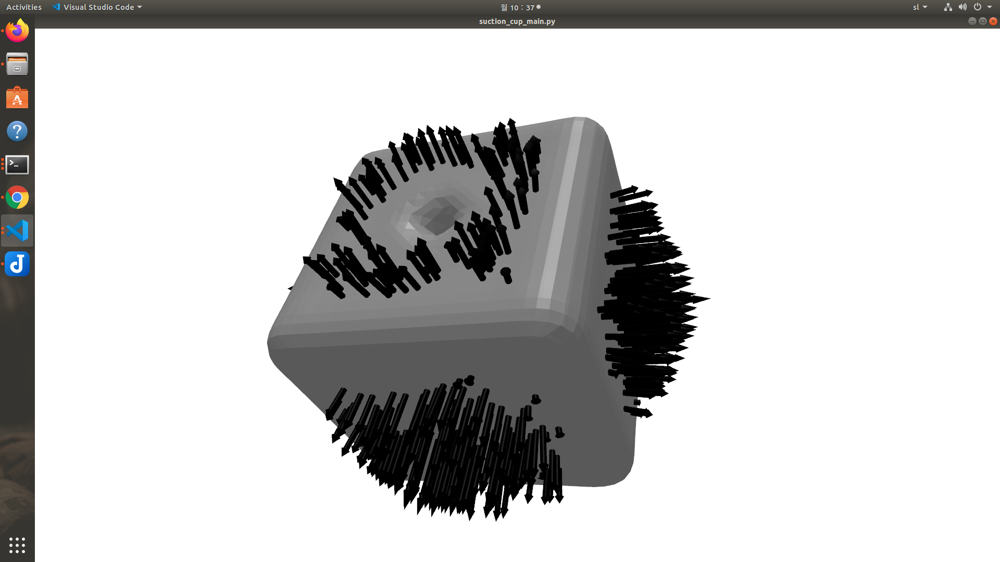

# ContinuousSuctionCupModel
## Contents
- [ContinuousSuctionCupModel](#continuoussuctioncupmodel)
  * [Requirements](#requirements)
  * [Installation](#installation)
  * [Usage](#usage)
    + [Continious Suction Cup Model](#continious-suction-cup-model)
    + [Grasp Dataset](#grasp-dataset)
    + [Suction Grasp Net](#suction-grasp-net)
  * [Examples](#examples)

## Requirements
   - python3 >= 3.6
   - tensorflow >= 2.3.0

## Installation
1. Install Triemsh Visualize Wrapper
   - Clone the repository from: https://github.com/JureHudoklin/trimesh_visualize
   - Follow the Installation procedure in the repository
3. Install PointNet++ 
   - Go to pointnet2-tensorlow2 subfolder: ``` cd pointnet2-tensorflow2 ```
   - Install the poitnet by running:
   ```
   chmod u+x tf_ops/compile_ops.sh
   tf_ops/compile_ops.sh
   ```
5. Install other requirements
   - run: ```pip install -r requirements.txt```

## Usage
Below are a few examples of how the code can be used

### Continious Suction Cup Model
- To test the Continious Suction Cup models a set of functions is available in "suction_model/suction_cup_main.py":
- 
    ``` python
    test_contact_point(file_loc, 
                       test_point=np.array([0, 0, 0]), 
                       display_contact=True):
    ```
    Performs a full analysis of a contact point (seal evaluation, force evaluation, seal score, force score)
-   ``` python
    evaluate_object_set(root_dir,
                        config_path = None,
                        number_of_points=3000,
                        splits="test",
                        save=True,
                        overwrite=False,
                        display=False,
                        n_processors=8):
    ```
    Evaluates a set of objects. 

-   ``` python
    def evaluate_object_one(obj_name,
                        root_dir,
                        config_path = None,
                        number_of_points = 3000,
                        display=True,
                        splits="test",
                        save=False):
    ```
    Evaluates a single object.

### Grasp Dataset
- The dataset must have the following folder structure:
    - root_dir/
        - meshes/
        - grasps/
        - scenes_3d/
            - \<splits>/
- Helper functions for accessing the dataset are locatied in utils.py
    - A grasp can be loaded using:
        ``` python
        load_grasp(obj_name, grasp_root_dir, filetype=".pkl")
        ```
    - A mesh can be loaded using:
        ``` python
        load_mesh(filename, mesh_root_dir, scale=0.001):
        ```
    - A 3D scene can be loaded using:
        ``` python
        load_scene_3d(filename, data_root_dir):
        ```

- To generate 3D pointcloud scenes you can use data_generator.py
- If you would like to access the dataset please contact me at: jure.hudoklin97@gmail.com
- If you use our code please cite our article:
    ```
    @article{hudoklin2022vacuum,
    title={Vacuum Suction Cup Modeling for Evaluation of Sealing and Real-timeSimulation},
    author={Hudoklin, Jure and Seo, Sungwon and Kang, Minseok and Seong, Haejoon and Luong, Anh Tuan and Moon, Hyungpil},
    journal={IEEE Robotics and Automation Letters},
    year={2022},
    publisher={IEEE}
    }
    ```

### Suction Grasp Net
- \<In progress>

## Examples

- Example video of Suction Grasp Net (press on the image to view):

   [](http://www.youtube.com/watch?v=conTv7kHwe8 "Suction Grasp Net + Contact Grasp Net - Bin Picking")
   
- Model analysis performed by the Continuous Suction Cup Model:

    

    
